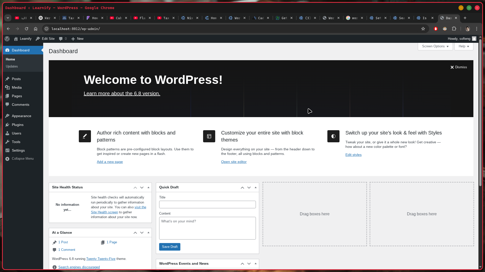

# nixpress

> 🌀 Reproducible WordPress + PHP + Nginx development environment powered by Nix Flakes




**nixpress** is a Nix-based development stack for WordPress and PHP applications, designed with NixOS users in mind. It provides a declarative, reproducible setup using Nix Flakes, making it easy to spin up a complete local environment with:

- ✅ WordPress
- ✅ PHP (with extensions)
- ✅ Nginx
- ✅ MariaDB (MySQL-compatible)
- ✅ Redis
- ✅ TLS via Caddy (optional)

---

## 🚀 Features

- 📦 **Fully reproducible** using Nix flakes
- 🐘 PHP + Nginx with FastCGI support
- 📚 WordPress auto-installable setup
- 🧠 Redis for caching support
- 🔒 Optionally supports TLS using mkcert & Caddy
- 🔧 Easy to extend and customize

---

## 🛠 Requirements

- [Nix](https://nixos.org/download.html) with flakes enabled
- NixOS (recommended)
- `git`, `mkcert` (optional for TLS)

---

## 🔧 Getting Started

Clone the repo and enter the dev shell:

```bash
git clone https://github.com/SoftEng-Islam/nixpress
cd nixpress
devenv up
